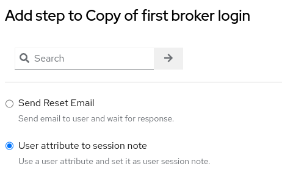
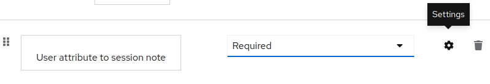
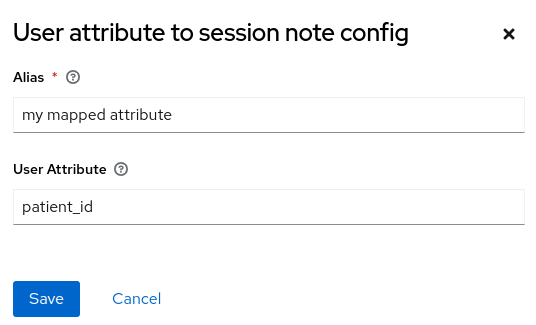

# keycloak extension: user-attribute-to-session-note

A simple Keycloak extension which implements an authenticator flows to be used to copy existing user attributes to user session notes.

This extension will let you configure an attribute name to be used via the admin UI, and report sucess or fail to the default log.

The use-case for this was to modify the access token response of a SMART on FHIR launch sequence, to include the patient resource id to the token response. This extension is used in combination with a subsequent 'User Session Note' mapper on one of the required scopse to add this patien id to the response.


## Development / Installation

```shell
mvn clean install
```

On Keycloak `21.0.1`: deploy the `target/keycloak-user-attribute-to-session-note-2.0.1.jar` to `/opt/keycloak/providers` and build keycloak.

## Using the Provider
- Add the extension to a flow:

- Set it to be required and open the settings page ..

- .. to set the attribute name to be used


